# 🫁 AI-Based Differentiation of ARDS vs Pulmonary Cardiogenic Edema using Lung Ultrasound

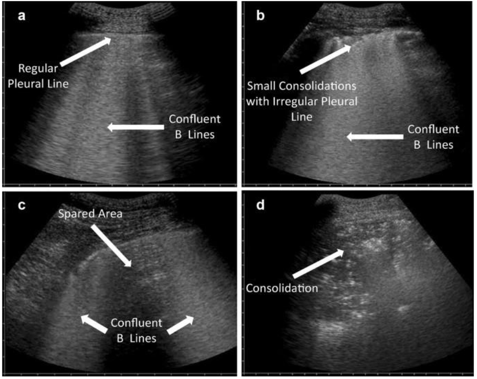

Deep Learning • Explainable AI • Lung Ultrasound • Medical Imaging

---

## 📌 Overview

Acute Respiratory Distress Syndrome (**ARDS**) and Cardiogenic Pulmonary Edema (**CPE**) are life-threatening pulmonary conditions that often exhibit highly similar lung ultrasound findings, making differential diagnosis challenging.

Despite similar ultrasound appearances, both diseases require fundamentally different treatment strategies. Incorrect diagnosis may lead to inappropriate interventions and poor clinical outcomes.

This project develops an AI-assisted diagnostic framework capable of learning discriminative lung ultrasound patterns and providing interpretable predictions through Grad-CAM based explainability.

---

## 🚨 Why This Problem Matters

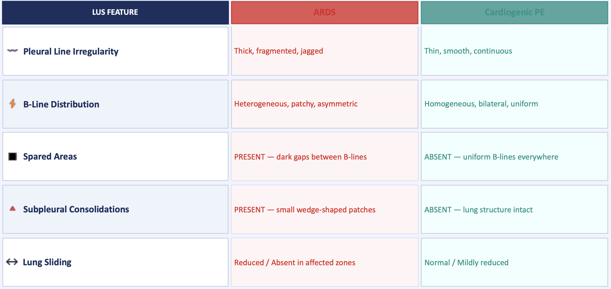

| ARDS                        | Cardiogenic Pulmonary Edema |
| --------------------------- | --------------------------- |
| Lung Protective Ventilation | Diuretics                   |
| Prone Positioning           | Heart Failure Management    |
| Treat Sepsis / Trauma       | Fluid Restriction           |
| Diuretics Can Be Harmful    | Diuretics Are Essential     |

### Misdiagnosis = Wrong Treatment

Current clinical interpretation relies heavily on expert assessment of B-lines and pleural abnormalities, leading to variability among clinicians.

---

# 🎯 Project Objectives

* Develop an automated lung ultrasound classification framework
* Explore transfer learning using ResNet50 and GoogLeNet
* Design a lightweight custom CNN architecture
* Visualize model decisions using Grad-CAM
* Investigate feasibility of future ARDS vs CPE classification systems

---

# 🏥 Pulmonary Ultrasound Features

The model learns clinically relevant ultrasound characteristics:

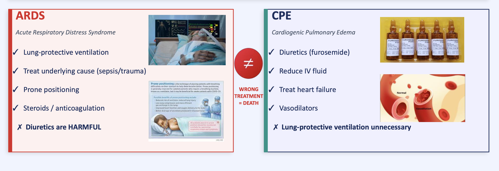

### Important Diagnostic Features

* Pleural Line Irregularity
* B-Line Distribution
* Spared Areas
* Subpleural Consolidations
* Lung Sliding

---

# ⚙️ Methodology

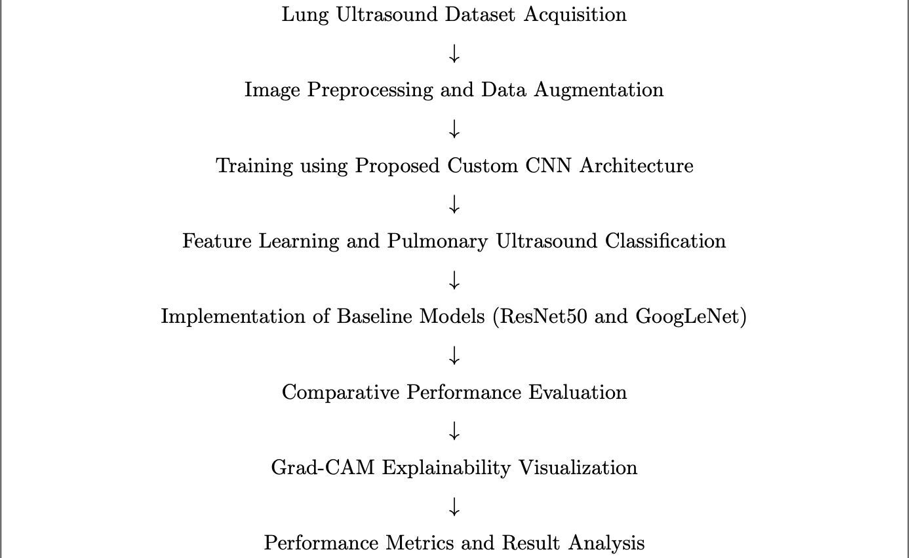

The complete pipeline consists of:

1. Dataset Acquisition
2. Image Preprocessing
3. Data Augmentation
4. Deep Feature Learning
5. Classification
6. Explainability Analysis
7. Performance Evaluation

---

# 📂 Dataset

## COVID-19 Lung Ultrasound Dataset

Because publicly available ARDS vs CPE datasets are extremely limited, a COVID-19 Lung Ultrasound dataset was used for validating the framework.

### Classes

* COVID-19
* Pneumonia
* Healthy

### Representative Samples

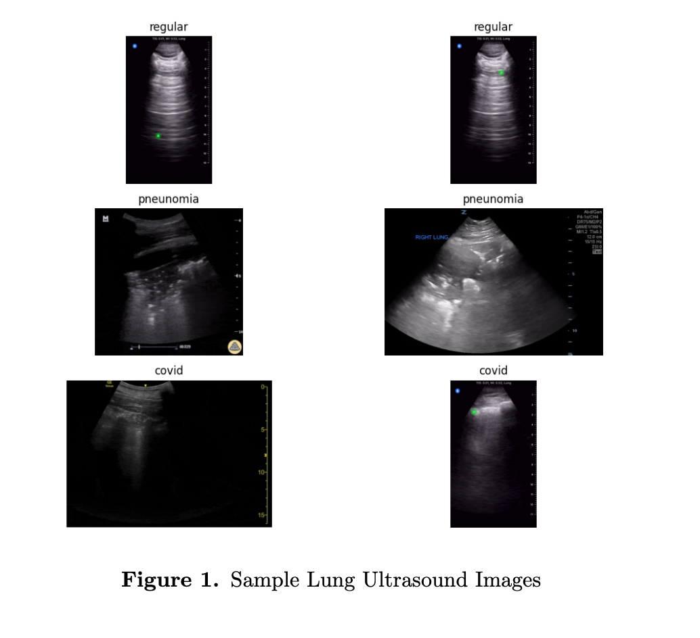

---

# 🧹 Preprocessing Pipeline

### Operations

✔ Image Resizing

✔ Pixel Normalization

✔ Data Augmentation

✔ Dataset Splitting

### Augmentation Techniques

* Rotation
* Horizontal Flip
* Zoom
* Brightness Variations

---

# 🧠 Deep Learning Models

## 1️⃣ ResNet50

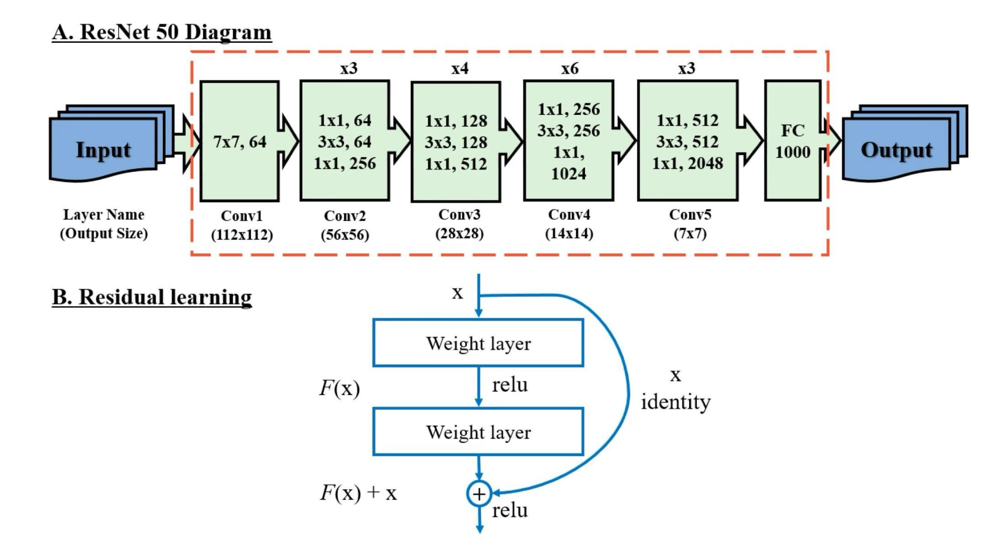

Transfer learning using ImageNet pretrained weights for pulmonary feature extraction.

---

## 2️⃣ GoogLeNet

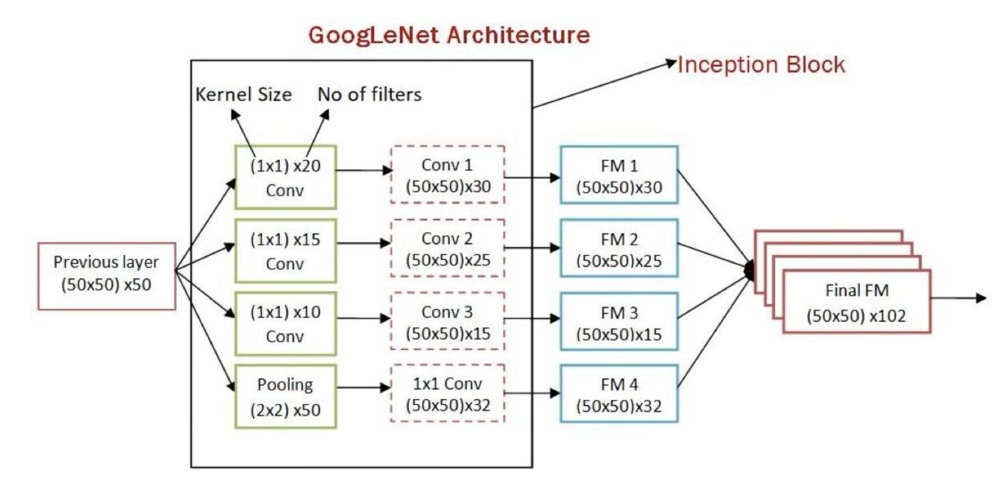

Inception modules enable multi-scale pulmonary ultrasound feature learning.

---

## 3️⃣ Proposed Lightweight CNN

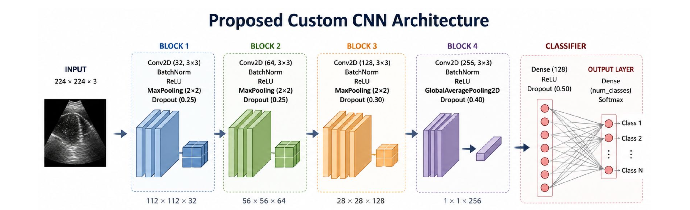

### Architecture Summary

| Block   | Filters |
| ------- | ------- |
| Block 1 | 32      |
| Block 2 | 64      |
| Block 3 | 128     |
| Block 4 | 256     |

Features:

* Batch Normalization
* Dropout Regularization
* Global Average Pooling
* Softmax Classification

---

# 🔍 Explainable AI (Grad-CAM)

Understanding why a model makes a prediction is critical in healthcare applications.

Grad-CAM visualizations highlight diagnostically important pulmonary regions used by the model.

### Example Explainability Maps

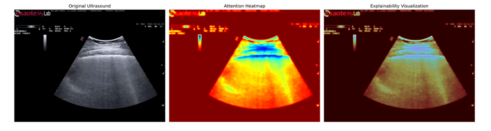

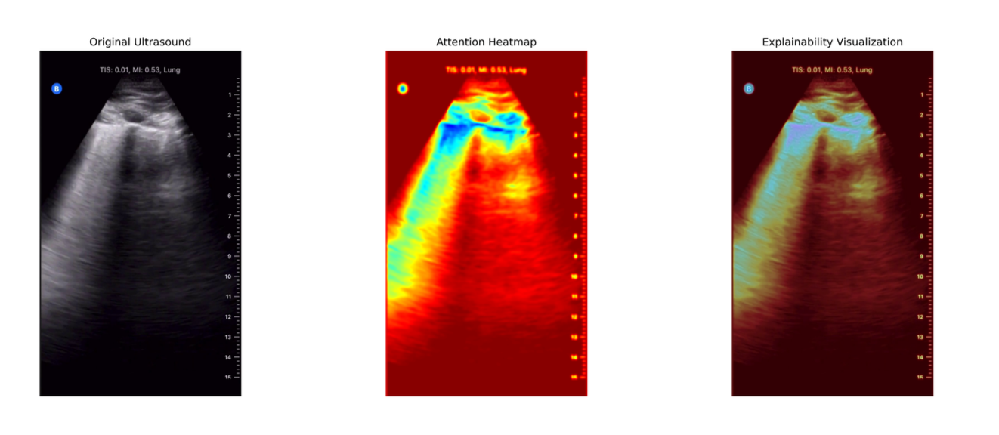

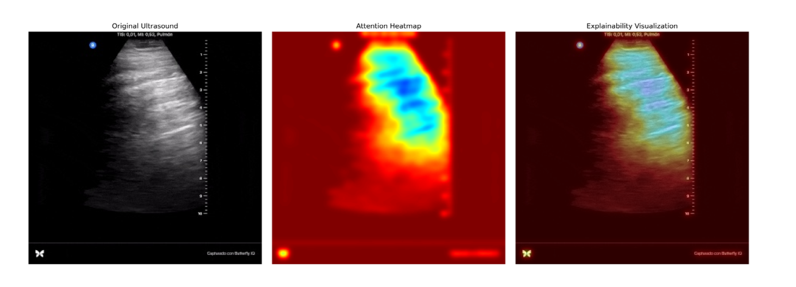

---

# 📊 Experimental Results

## Sample Predictions

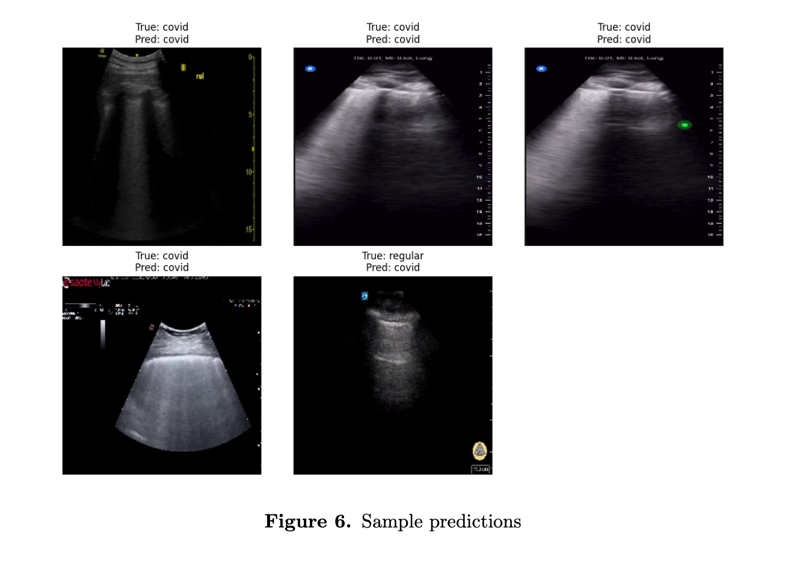

---

## Training & Validation Loss

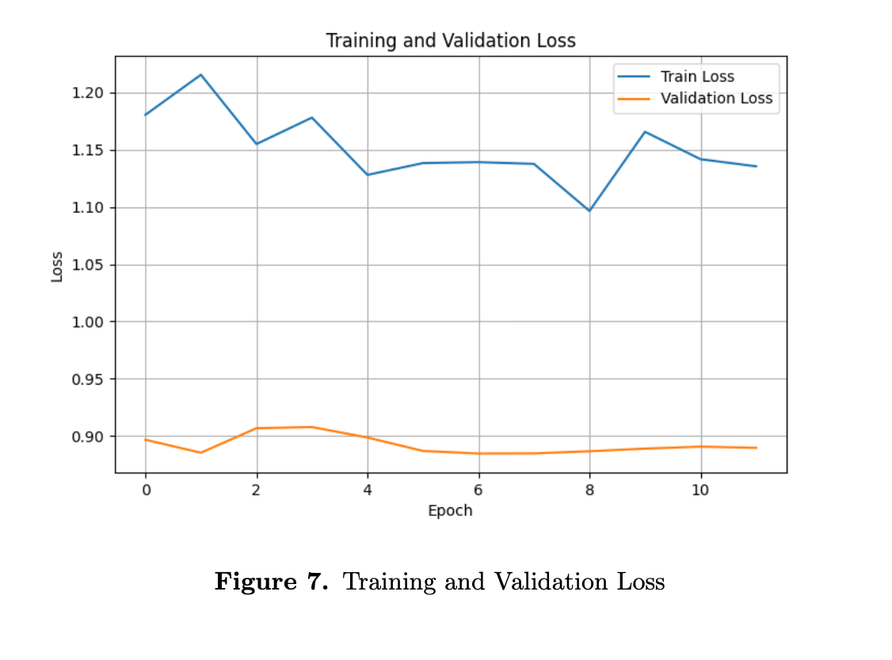

---

## Confusion Matrix

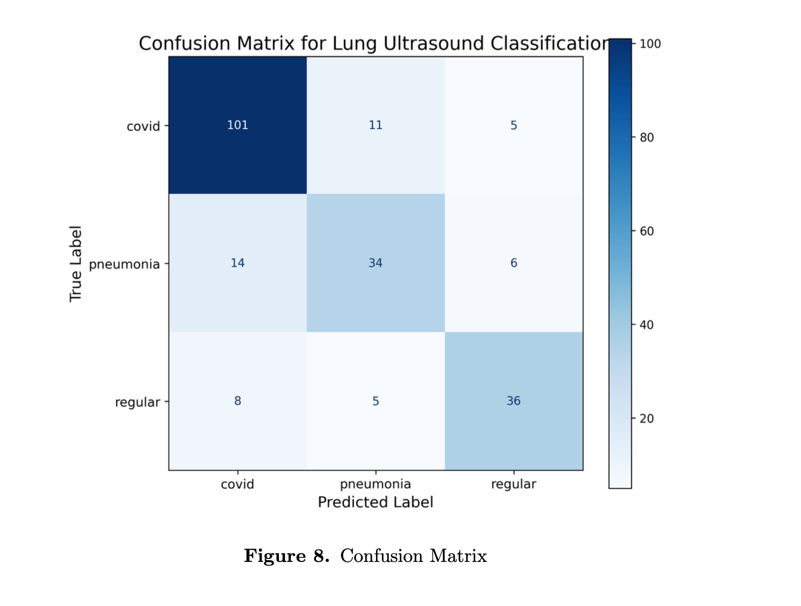

---

# 🛠️ Technology Stack

| Category             | Tools             |
| -------------------- | ----------------- |
| Programming          | Python            |
| Deep Learning        | TensorFlow, Keras |
| Computer Vision      | OpenCV            |
| Scientific Computing | NumPy, SciPy      |
| Machine Learning     | Scikit-Learn      |
| Explainable AI       | Grad-CAM          |

---

# 🚀 Future Work

* Dedicated ARDS vs CPE Dataset
* CNN + LSTM Video Analysis
* Multi-Center Clinical Validation
* Real-Time Bedside Deployment
* Handheld Ultrasound Integration

---

# 👨‍💻 Author

### Achyuth Krishna Namburi

M.Tech – Computer Science & Engineering

National Institute of Technology Karnataka (NITK Surathkal)

Supervisor: Prof. Annappa B

---

⭐ If you find this project useful, please consider starring the repository.
